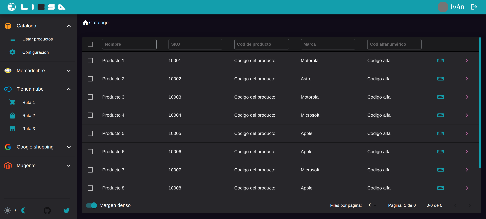
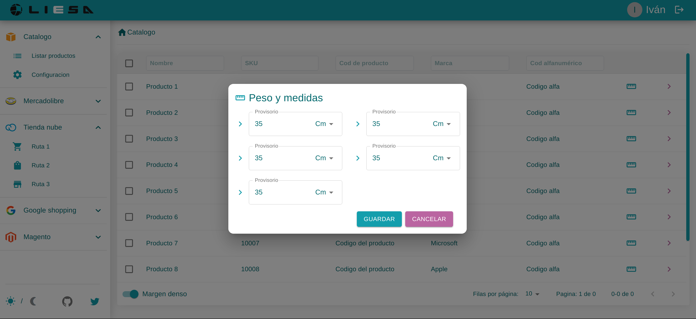
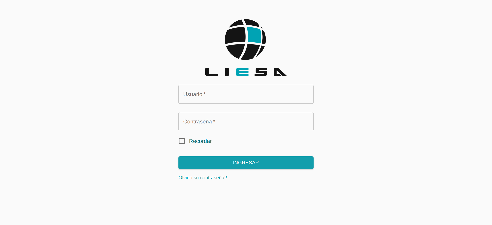

## Middleware

Esta aplicacion hecha en react es la encargada de gestionar algunos atributos de los productos para que puedan ser cargador y subidos al ERP de la empresa.

Tiene una conexion con una API hecha en .NET, pero es posible probarla para fines demostrativo con un Stub de productos hecho en memoria dentro del cliente.


## Como iniciar

Necesitamos Node.js y el gestos de paquetes npm para poder iniciar la aplicacion, juego instalamos npx


```sh
npm install -g npx
```

Tambien vamos a necesitar Yarn

```sh
npm install --global yarn
```

Una vez instalado corremos el siguiente comando para descargar las dependencias del package.json

```sh
yarn
```

Finalmente corremos la aplicacion con el siguiente comando

```sh
yarn start
```

## Imagenes de muestra




